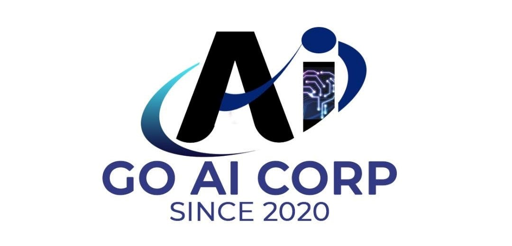

  <h1> Stage IA Selever - Cours & Projets - GO AI Corp</h1>
  

    🕸 <a href="https://www.linkedin.com/in/anyantudre">LinkedIn</a> • 
    📙 <a href="https://www.kaggle.com/waalbannyantudre">Kaggle</a> • 
    💻 <a href="https://anyantudre.medium.com/">Medium Blog</a> • 
    🤗 <a href="https://huggingface.co/anyantudre">Hugging Face</a> • 
  

 

# Description

Ce repo GitHub contient toutes les **Ressources** ainsi que les **Mini Projets** sur lesquels nous travaillons dans le cadre du **stage IA (projet Selever).**
L'objectif principal est de préparer, sur le plan théorique et pratique, les stagiaires au projet principal qui concerne la réalisation d'un **traducteur automatique pour les langues locales du Burkina Faso (Mooré, Dioula, Fulfuldé) en utilisant des techniques avancées de Neural Machine Translation et les transformers.**

Durant cette période de préparation, nous allons nous plonger dans les notions essentielles du **Natural Language Processing (NLP)** avec notamment des librairies comme **Hugging Face 🤗 transformers**, **Keras** et **Tensorflow**. 

**Contenu:**
-  **Mini-Projets & Applications Pratiques**, 
-  **Supports de Cours utilisés**,
-  **Ressources à consulter absolument**, et
-  **Ressources supplémentaires pour approfondir vos connaissances**

# Structure du repository

Les répertoires de ce repo sont organisés comme suit :  

## 1. Mini-Projets & Applications Pratiques

| Titre | Technologies utilisées | Description  | Notebook |
|---------|--------------------|-------------------------------|----------------------------------------------------------|
| **1. Sentiment Analysis** |  **Keras, RNN, LSTMs** | Analyser les sentiments de commentaires en ligne | [Open or Download](https://github.com/ANYANTUDRE/Stage-IA-Selever-GO-AI-Corp/blob/main/01.%20Notebooks%20-%20Mini%20Projets%20et%20Applications%20Pratique/01.%201er%20Mini%20Projet%20-%20Sentiment%20Analysis%20with%20Keras.ipynb) |

## 2. Séances de Formations & Supports de Cours

| Titre | Date | Objectifs | Supports | 
|---------|---------|-------------------|--------------------------------|
| **1. Intro au Deep Learning & NLP** | 17/04/2024, 19h GMT | Introduire les concepts fondamentaux de **Réseaux de Neurones**, de **Backpropagation** ainsi que le **pipeline classique du NLP** | [Supports](https://github.com/ANYANTUDRE/Stage-IA-Selever-GO-AI-Corp/tree/main/02.%20Supports%20de%20Cours%20-%20Formations/01.%20S%C3%A9ance%201)|
| **2. 1er Projet et Intro to Generative AI & Transformers** | 27/04/2024, 19h GMT | Pratiquer les notions de **OneHotEncoding, Embedding, RNNs, LSTMs** & Vue d'ensemble sur l'**IA Générative**, le **Prompt Engineering** et l'**architecture des Transformateurs** (high level) | [Supports](https://github.com/ANYANTUDRE/Stage-IA-Selever-GO-AI-Corp/tree/main/02.%20Supports%20de%20Cours%20-%20Formations/02.%20S%C3%A9ance%202) |
| **3. 2ème Projet & Architecture détaillée des Transformers** |  | Détails sur les Encodeurs, les Décodeurs et les Encodeurs-Décodeurs  | [Supports](https://github.com/ANYANTUDRE/Stage-IA-Selever-GO-AI-Corp/tree/main/02.%20Supports%20de%20Cours%20-%20Formations/03.%20S%C3%A9ance%203) |
| **4. Utilisation des Transformers avec Hugging Face** | 19/05/2024, 19h GMT  | Introduction à la bibliothèque Transformers de Hugging | [Supports](https://github.com/ANYANTUDRE/Stage-IA-Selever-GO-AI-Corp/tree/main/02.%20Supports%20de%20Cours%20-%20Formations/04.%20S%C3%A9ance%204%20-%20Utilisation%20des%20Transformers%20de%20Hugging%20Face) |

## 3. Les Ressources à consulter absolument

| Titre | Connaissances à acquérir | Brève Description  | Liens |
|---------|--------------------|-------------------------------|----------------------------------------------------------|
| **1. NLP Course on Hugging Face** |  **Transformers** | Cours sur le NLP et la bibliothèque transformers de Hugging Face| [Lien](https://github.com/ANYANTUDRE/NLP-Course-Hugging-Face) |
| **2. Formation FIDLE** | **Maths & Backpropagation, CNNs, RNNs, Transformers, GNNs etc...**  | Formation d'Introduction au Deep Learning sur Youtube | [Lien](https://www.youtube.com/playlist?list=PLlI0-qAzf2SZQ_ZRAh4u4zbb-MQHOW7IZ) |

## 4.  Les Ressources supplémentaires pour approfondir vos connaissances

| Titre | Connaissances à acquérir | Brève Description  | Liens |
|---------|--------------------|-------------------------------|------------------------|
| **1. Formation FIDLE** | **Maths & Backpropagation, CNNs, RNNs, Transformers, GNNs etc...**  | Formation d'Introduction au Deep Learning sur Youtube | [Lien](https://www.youtube.com/playlist?list=PLlI0-qAzf2SZQ_ZRAh4u4zbb-MQHOW7IZ) |
